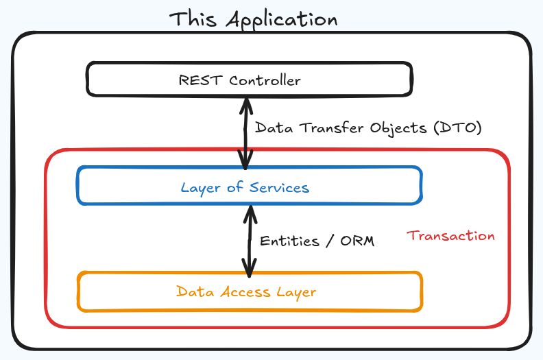

Applying knowledge of Validations, Layered Structure, Data Transfer objects and Spring Frammework.

### Project Overview
This application is a **Spring Boot REST API** designed for robust Client Management, serving as a backend service that bridges a relational database with external consumers. It utilizes **Data Transfer Objects (DTOs)** to decouple the internal database schema from the external API layer, ensuring that sensitive data is protected and communication remains efficient. By implementing the **Service Layer pattern**, the application maintains a clean separation of concerns, where business logic is isolated from the web controller and data access repository.

<p align="center">
  
</p>

### Core Features & Validation
The system is built with a strong focus on **Data Integrity and Validation**. Using Jakarta Bean Validation, the application enforces strict rules—such as mandatory name lengths, valid CPF formatting, and logical constraints on income—directly at the request level. This proactive validation, combined with custom exception handling, ensures that the system provides clear, meaningful feedback (400 Bad Request) while preventing the persistence of corrupt information in the **H2 database**.

### Development & Seeding
To facilitate development, the application features an **automated data seeding** mechanism and an integrated H2 console. Upon startup, it utilizes an `import.sql` script to populate the environment with 20 pre-defined American client profiles. This allows for immediate verification of features like **pagination and sorting**. This combination of automated validation and seamless database initialization makes it a reliable and maintainable template for modern enterprise Java applications.

---

## 🛠️ Tech Stack
* **Java 21**
* **Spring Boot**
* **Spring Data JPA**
* **Bean Validation (Hibernate Validator)**
* **H2 Database** (In-memory)

## 🚀 How to Run
1.  **Clone the repository**:
    ```bash
    git clone [https://github.com/your-username/crud-clientes.git](https://github.com/your-username/crud-clientes.git)
    ```
2.  **Run the application**:
    Use your IDE or run `./mvnw spring-boot:run` in the terminal.
3.  **Access the Database**:
    Navigate to `http://localhost:8080/h2-console`
    * **JDBC URL**: `jdbc:h2:mem:testdb`
    * **User**: `sa`
    * **Password**: (empty)

## 📡 API Endpoints
| Method | Endpoint | Description |
| :--- | :--- | :--- |
| **GET** | `/clients` | List all clients (Paged) |
| **GET** | `/clients/{id}` | Get client by ID |
| **POST** | `/clients` | Create a new client |
| **PUT** | `/clients/{id}` | Update an existing client |
| **DELETE** | `/clients/{id}` | Remove a client |
